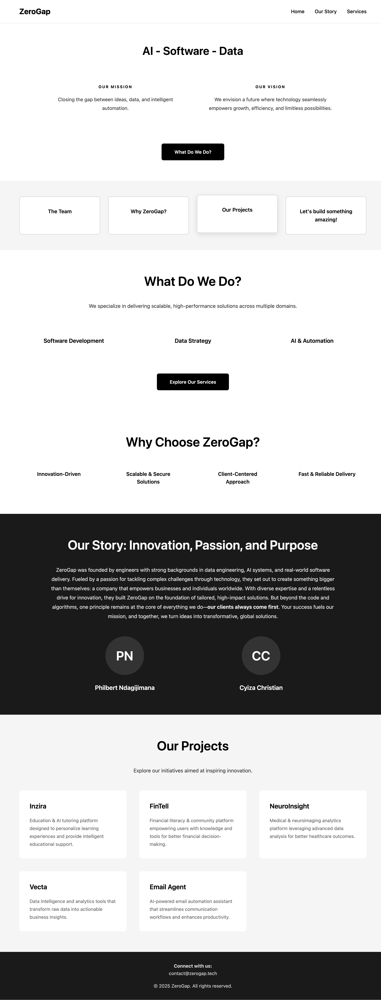

# ZeroGap Website

A modern, professional website for ZeroGap - AI, Software, and Data solutions company.



## Project Structure

```
ZeroGap/
├── index.html              # Main HTML file (clean structure)
├── css/
│   └── styles.css          # All stylesheets
├── js/
│   └── script.js           # All JavaScript functionality
├── README.md               # Documentation
└── ZeroGap Website.docx    # Original requirements
```

## Features

### Three Main Pages
1. **Home** - Complete overview with all sections
2. **Our Story** - Detailed founder information and company mission
3. **Services** - Full service details and contact form

### Design Highlights
- Clean black and white color scheme
- Responsive design (mobile, tablet, desktop)
- Smooth animations and transitions
- Modern typography using Poppins font
- Interactive navigation with hamburger menu on mobile
- Proper separation of concerns (HTML, CSS, JS)

### Sections Included

#### Home Page:
- **Hero Section** - Mission & Vision statements
- **Quick Links Grid** - Easy navigation to key sections
- **What We Do** - Services preview
- **Why Choose ZeroGap** - Key differentiators
- **Founders** - Team introduction
- **Projects** - Portfolio showcase (Inzira Platform, Inzira Labs, FinTell, NeuroInsight, Vecta, Email Agent)

#### Services Page:
- **Full Service Details**:
  - Software Development
  - Data Strategy
  - Automation & AI Enablement
  - Consulting & Technical Advisory
- **Contact Form** - Direct email integration

## How to Use

### Option 1: Open Directly
Simply double-click `index.html` to open in your default browser.

### Option 2: Use a Local Server (Recommended)
For better performance and testing:

```bash
# Using Python 3
python3 -m http.server 8100

# Using Python 2
python -m SimpleHTTPServer 8100

# Using Node.js (http-server)
npx http-server -p 8100
```

Then visit `http://localhost:8100` in your browser.

## Responsive Breakpoints

- **Desktop**: 769px and above
- **Tablet**: 481px - 768px
- **Mobile**: 480px and below

## Technologies Used

- **HTML5** - Semantic markup
- **CSS3** - Grid, Flexbox, Animations
- **Vanilla JavaScript** - No dependencies or frameworks

## Code Quality

- **Proper separation of concerns** - HTML, CSS, JS in separate files
- **Maintainable** - Easy to find and edit code
- **Scalable** - Add new pages without duplicating code
- **Performance** - Browser can cache CSS and JS files
- **Clean structure** - Professional codebase organization

## Contact Form

The contact form uses `mailto:` functionality to open the user's email client with pre-filled information. Email is sent to: `contact@zerogap.tech`

## Projects Featured

1. **Inzira Platform** - Education & AI tutoring platform
2. **Inzira Labs** - Research translation space bridging research findings and user products
3. **FinTell** - Financial literacy & community platform
4. **NeuroInsight** - Medical & neuroimaging analytics
5. **Vecta** - Data intelligence and analytics tools
6. **Email Agent** - AI-powered email automation

## Founders

- **Philbert Ndagijimana** (PN)
- **Cyiza Christian** (CC)

## Editing Guide

### To modify styles:
Edit `css/styles.css` - all colors, layouts, fonts, and responsive design

### To modify functionality:
Edit `js/script.js` - all navigation, form handling, and interactions

### To modify content:
Edit `index.html` - all text, sections, and structure

## Contact

**Email**: contact@zerogap.tech

---

© 2025 ZeroGap. All rights reserved.
